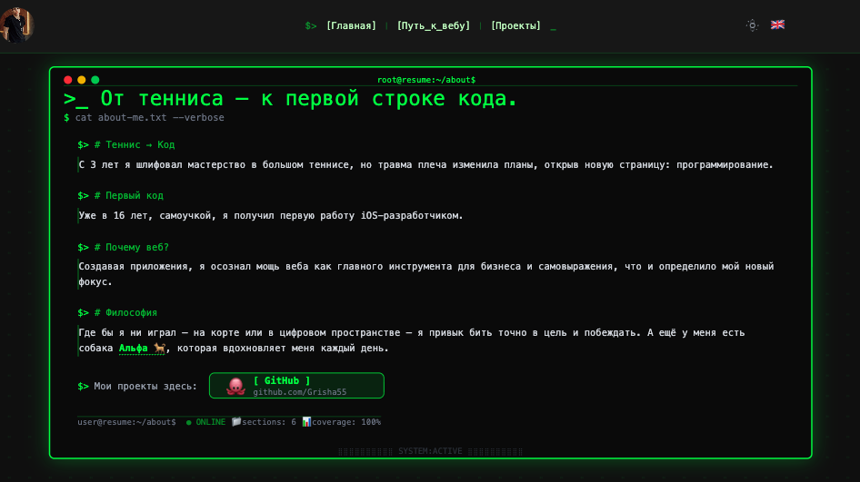
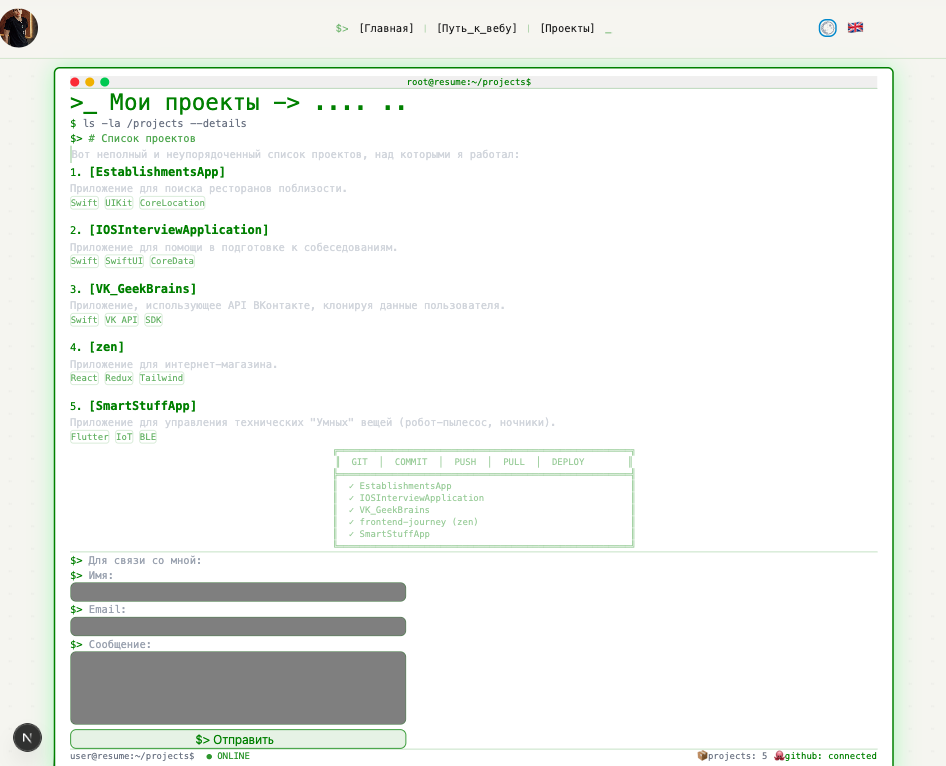

# 💀 Hackers Resume — Мое резюме в хакерской стилистике

> _От тенниса — к первой строке кода. От яблочной экосистемы — к миру веб-разработки._

<div align="center">

  [](https://nextjs.org/)

  [](https://www.typescriptlang.org/)

  [](https://tailwindcss.com/)

  [](https://next-intl.dev/)
  
  
</div>

---

## 📟 О проекте

**Hackers Resume** — это не просто резюме, это полноценный веб-сайт-портфолио в стиле киберпанк/хакерской эстетики. Здесь я рассказываю свою историю: от профессионального тенниса до веб-разработки, демонстрирую проекты, делюсь интересами (теннис, книги, моя собака Альфа) и предлагаю способы связи.

Проект полностью адаптивен, поддерживает два языка (русский/английский) и имеет темы оформления (тёмная/светлая).

## ⚡ Основные возможности

| Функция | Описание |
|---------|----------|
| 🎨 **Хакерский UI** | Терминальные окна, эффект сканирования, ASCII-арт, матричный фон |
| 🌍 **i18n локализация** | Полная поддержка русского и английского языков |
| 🌓 **Темы оформления** | Тёмная (киберпанк) и светлая (чистый терминал) темы с CSS-переменными |
| 📱 **Адаптивность** | Корректное отображение на мобильных устройствах, планшетах и десктопах |
| 📚 **Динамические страницы** | Страницы с книгами, проектами, фотографиями Альфы через API |
| 🖼️ **JSON Server** | Полноценный мок-бэкенд для управления контентом и изображениями |
| ✨ **Эффекты** | Печатающийся текст (TypingHeader), неоновое свечение, глитч-эффекты |

## 🛠️ Технологический стек

### Frontend Core
- **[Next.js 16](https://nextjs.org/)** — React-фреймворк с App Router
- **[TypeScript](https://www.typescriptlang.org/)** — типобезопасность
- **[React 18](https://react.dev/)** — UI-библиотека

### Styling & UI
- **[Tailwind CSS](https://tailwindcss.com/)** — утилитарный CSS-фреймворк
- **CSS Custom Properties** — динамическая смена тем (светлая/тёмная)
- **Анимации:** `animate-pulse`, `animate-scan`, `animate-glitch`, `animate-shimmer`

### i18n (Интернационализация)
- **[next-intl](https://next-intl.dev/)** — локализация и мультиязычность
- Поддерживаемые языки: **русский (ru)**, **английский (en)**

### Backend & API
- **[JSON Server](https://github.com/typicode/json-server)** — мок-бэкенд для контента
- **[Multer](https://github.com/expressjs/multer)** — загрузка файлов (изображения секций)

### Разработка и инструменты
- **Turbopack** — быстрая сборка в режиме разработки
- **ESLint** — линтинг кода
- **Prettier** — форматирование (предположительно)


## 🚀 Установка и запуск

### 1. Клонирование репозитория
```bash
git clone https://github.com/Grisha55/my-resume.git
cd my-resume
```
### 2. Запуск JSON Server (мок-бэкенд)
```bash
npm run json-server
# Сервер запустится на http://localhost:8000
```

## 🎨 Демонстрация скриншотов
<div align="center">   </div>

## 📬 Контакты
- Email: grishavinyar64@gmail.com
- GitHub: github.com/Grisha55
- Telegram: @gregoryvinyar

⭐ Если вам понравился проект, не забудьте поставить звёздочку! ⭐
